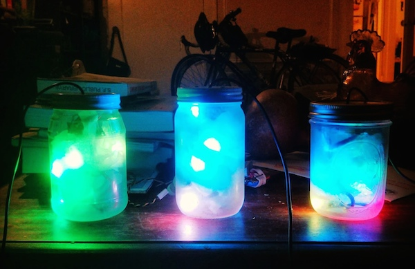
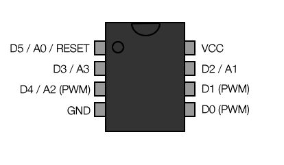

Programmable Touch Firefly Jar 
================================

Programmable touch firefly lamp. For use with ATtiny85 (or Arduino!) and [Neopixel](https://www.adafruit.com/categories/37) (WS2811/12/12B) RGB LEDs. 

Full build details over at [Instructables](http://www.instructables.com/id/Programmable-LED-Firefly-Jar/).

You can grab PCBs via [OSHPark](http://oshpark.com/shared_projects/p76iCXLt).

Instructions
------------

* Download Adafruit's [NeoPixel](https://github.com/adafruit/Adafruit_NeoPixel) library and the [Capacitive Sense](http://playground.arduino.cc//Main/CapacitiveSensor) library
* Get the [ATtiny cores](https://code.google.com/p/arduino-tiny/) for Arduino & a [programmer](https://www.adafruit.com/products/46)
* Attach your LED data line to Digital Pin 4
* Attach lid/touch sensor to Digital Pins 0 & 1
* Enjoy your technicolor LED light show

More Info
------------

Need help getting started with ATtiny and lights? I wrote an [Instructable](http://www.instructables.com/id/Use-a-1-ATTiny-to-drive-addressable-RGB-LEDs/) on that too.

If you're seeing 'R_AVR_13_PCREL' errors when you try to compile, try this [thread](http://forum.arduino.cc/index.php?topic=116674.0) for solutions. This is a known problem with Arduino IDE, ATtiny and sketches > 4k.

Acknowledgements
------------

Much thanks to [Adafruit](http://adafruit.com) for their NeoPixel Library, wonderful tutorials and all the work they do for open source, hardware hacking communities. Support them!

[Funkboxing](http://funkboxing.com/wordpress/?p=2154) for inspiring and cool LED effects and helper functions.

[Instructables](http://instructables.com) for featuring my project and a lovely community.
